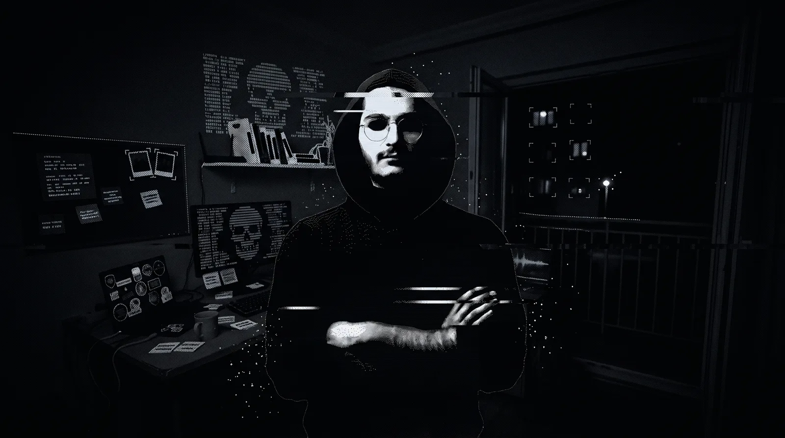

<div align="center">

# Decrypt Reveal

**Turn one photo into an interactive hero that hides a second, corrupted "hacker broadcast" truth — revealed through a cursor-following decrypt lens, with live glitches, particles, and real 3D depth parallax.**

Inspired by the Watch Dogs 2 / DedSec propaganda aesthetic. No 3D scanning, no photoshoot, no paid tools — just one photo, any AI image generator, and a zero-dependency script.



[**▶ Live demo & visual guide**](https://muhamadt4.github.io/decrypt-reveal/) · [**🎛 Playground**](https://muhamadt4.github.io/decrypt-reveal/playground.html) · [**📖 Asset guide**](WORKFLOW.md)

</div>

---

## What you get

| | |
|---|---|
| 🪄 **The effect** | A CSS-mask decrypt lens that follows the cursor, plus glitch bursts, RGB-split ghosts, scanlines, film tear, a broadcast HUD, and a particle canvas. |
| 🧊 **Real 3D** | An optional ~60-line WebGL shader parallaxes the photo against its background using a single depth map. |
| 📦 **Reusable library** | `dist/decrypt-reveal.js` + `.css` — one function call, every feature is a config option, graceful fallbacks built in. |
| 🎛 **Playground** | Upload your own images, tune every parameter live, and export a ready-to-paste snippet **or a single self-contained `.html` file**. |
| 📖 **Full asset workflow** | A battle-tested prompt pipeline for generating the two aligned images (and depth map) with any AI generator. |

Everything is static HTML/CSS/JS — **host it free on GitHub Pages.**

---

## Quick start

**1.** Copy `dist/decrypt-reveal.js` and `dist/decrypt-reveal.css` into your project.

**2.** Add a container and the stylesheet:

```html
<link rel="stylesheet" href="decrypt-reveal.css">
<div id="hero"></div>
<script src="decrypt-reveal.js"></script>
```

**3.** Initialise it with your two images:

```html
<script>
  DecryptReveal('#hero', {
    images: {
      base:      'scene.webp',       // your photoreal photo
      broadcast: 'broadcast.webp'    // the corrupted version of it
    }
  });
</script>
```

That's the whole thing. Move your cursor to scan, hold to decrypt.

> Don't have images yet? The [playground](playground.html) ships with a demo set — open it, swap in your own, and export.

---

## The full effect

Add shimmer frames and a depth map to switch on the rest:

```js
DecryptReveal('#hero', {
  images: {
    base:         'scene.webp',
    broadcast:    'broadcast.webp',
    frames:       ['frame-1.webp', 'frame-2.webp'],  // re-dithered variants → CRT shimmer
    depth:        'depth.png',                        // grayscale, bright = near → parallax
    parallaxBase: 'portrait.webp'                     // (optional) image the depth map moves
  },
  accent: '#7EB8DA',
  onDecrypt: () => console.log('ACCESS GRANTED')
});
```

See [`examples/minimal.html`](examples/minimal.html) and [`examples/full.html`](examples/full.html), or the step-by-step [**implementation guide (DOCS.md)**](DOCS.md) — including a copy-paste prompt that lets an AI coding agent wire everything up for you.

---

## Options

All options are optional except `images.base` and `images.broadcast`.

| Option | Default | What it does |
|---|---|---|
| `images.base` | — | **Required.** Layer 1, the photoreal scene. |
| `images.broadcast` | — | **Required.** Layer 2, the corrupted version (pixel-aligned to `base`). |
| `images.frames` | `[]` | Extra re-dithered variants; flipped for the dot shimmer. |
| `images.depth` | `null` | Grayscale depth map (bright = near). Enables WebGL parallax. |
| `images.parallaxBase` | `base` | Image the depth map displaces. |
| `lensRadius` | `0.24` | Hover lens size, as a fraction of `min(width, 1400)`. |
| `fullRadius` | `0.80` | Hold-to-decrypt size, as a fraction of the diagonal. |
| `softness` | `0.42` | Inner solid fraction of the mask (0–1). |
| `lag` | `0.13` | Cursor-follow smoothing — lower is laggier / more cinematic. |
| `radiusLag` | `0.085` | Radius smoothing. |
| `intro` | `true` | Auto-open a sweep on load so visitors discover the interaction. |
| `glitch` `scanlines` `particles` `vignette` | `true` | Toggle each garnish layer. |
| `flipInterval` | `700` | ms between shimmer-frame flips when idle (needs 2+ frames). |
| `flipBurst` | `80` | ms between frame flips during a glitch burst. |
| `hideCursor` | `true` | Hide the OS cursor; the effect draws its own reticle. |
| `hud` | `true` | Show the broadcast HUD (signal label, REC, decrypt readout). |
| `hudLabel` | `'SIGNAL_04'` | The signal label text. |
| `hint` | `'MOVE TO SCAN · HOLD TO DECRYPT'` | First-run hint, hidden after the first hover. |
| `accent` | `'#7EB8DA'` | Accent colour (CSS var `--dr-accent`). |
| `particleColor` | `'#DCEBF5'` | Particle / reticle colour. |
| `ghostTint` | `true` | RGB-split tint on the glitch ghosts. |
| `parallax` | `true` | Use the depth map if provided. |
| `parallaxStrength` | `[0.02, 0.014]` | `[x, y]` shift strength. |
| `onReveal(instance)` | `null` | Fires once when the lens first opens. |
| `onDecrypt(instance)` | `null` | Fires on hold-to-decrypt. |

### Instance methods

| Method | What it does |
|---|---|
| `instance.update(patch)` | Live-update cheap params (radius, lag, `softness`, `accent`, `particleColor`, `hudLabel`, `hint`, `ghostTint`, `flipInterval`, `flipBurst`, `parallaxStrength`) without a rebuild. |
| `instance.setPreview(bool)` | Pin the lens open (used by the playground so changes are always visible). |
| `instance.destroy()` | Remove listeners and stop the loop. |

> Structural options — which layers exist, the images, `parallax` on/off — need a fresh instance (`destroy()` then re-create).

---

## Making your two images

The illusion is **two pixel-aligned images of the same scene** — the normal photo underneath, the hacker version on top behind the mask. Alignment is the entire trick.

The [**asset guide (WORKFLOW.md)**](WORKFLOW.md) walks through the full pipeline with copy-paste prompts:

1. **Layer 1 — the scene.** Text-to-image from your portrait, seeded with "secret" objects.
2. **Layer 2 — the broadcast.** Image-to-image *from layer 1* with a "layout law" so composition stays locked.
3. **Variants.** Re-dither layer 2 for the shimmer frames.
4. **Depth map.** Feed layer 1 to a free depth estimator (Depth Anything, MiDaS).

The interactive [index page](index.html) explains and demonstrates every step visually.

---

## Project structure

```
decrypt-reveal/
├── index.html          # landing page + live demo + visual walkthrough
├── playground.html     # interactive configurator & exporter
├── WORKFLOW.md         # the AI asset-generation guide
├── dist/
│   ├── decrypt-reveal.js    # the reusable library (UMD, zero deps)
│   └── decrypt-reveal.css
├── examples/
│   ├── minimal.html    # simplest drop-in
│   └── full.html       # every feature on
├── assets/
│   ├── playground.css  # playground UI styles
│   ├── playground.js   # playground logic
│   └── demo/           # the demo image set
└── build-playground.js # embeds dist/ into playground.html (see below)
```

> **`build-playground.js`** — the playground embeds a copy of the library so its
> "Standalone .html" export works offline. If you edit anything in `dist/`, run
> `node build-playground.js` to refresh that embedded copy. (Not needed just to
> use the library — only if you change it.)

---

## Deploy to GitHub Pages

1. Push this repo to GitHub.
2. **Settings → Pages → Source: `main` branch, `/root`.**
3. Your site is live at `https://muhamadt4.github.io/decrypt-reveal/`.

No build step. It's static files.

---

## Browser support & fallbacks

- **`prefers-reduced-motion`** → static photo with a simple opacity crossfade, no canvas.
- **No WebGL** → the parallax silently degrades to the plain photo; everything else keeps working.
- **Touch** → drag to scan, long-press to decrypt (`touch-action: none`).
- Runs on the GPU compositor (only `opacity` / `transform` / `clip-path` / mask vars animate per frame), so it's smooth on phones.

---

## License

MIT © contributors. Use it, remix it, ship it — a credit link back is appreciated but not required.
